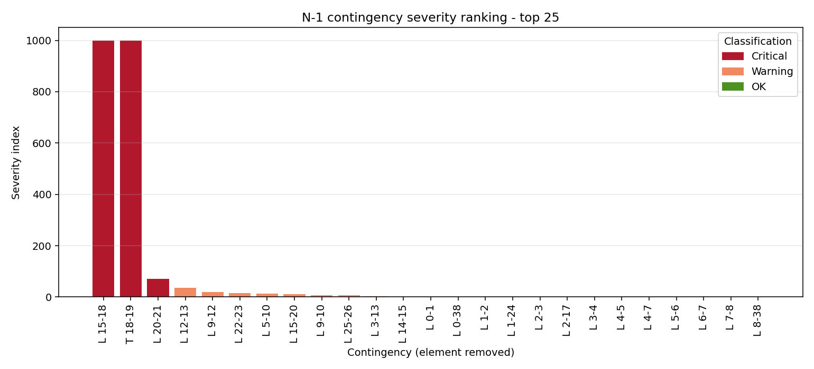
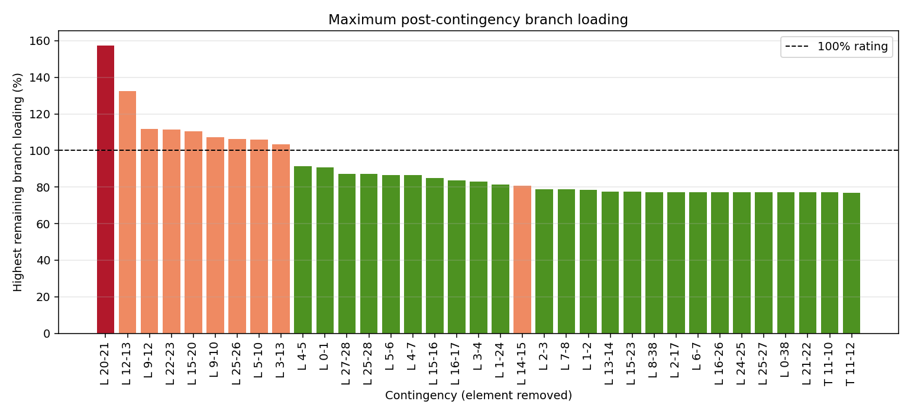
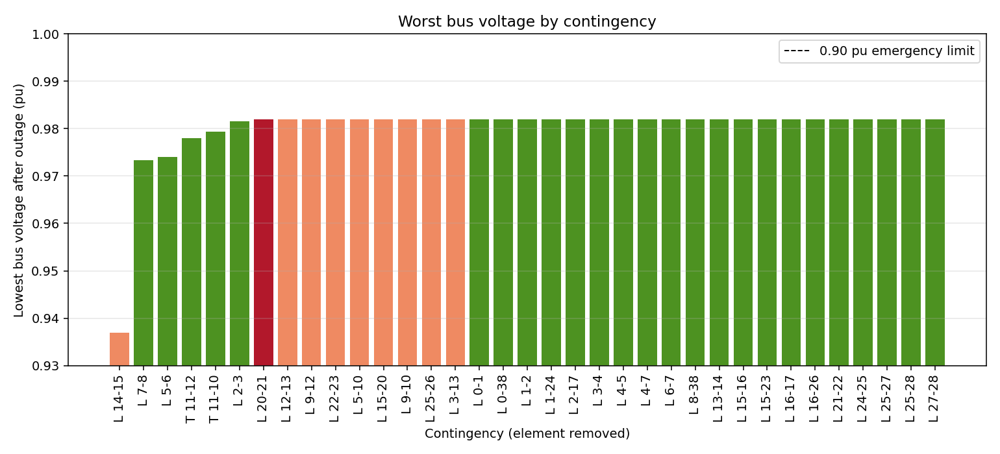
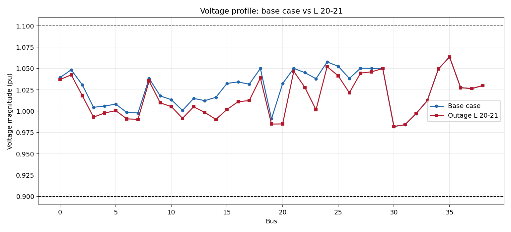
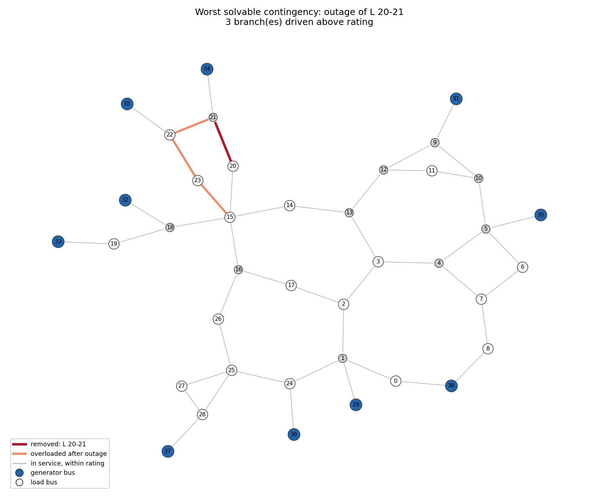

# New England 39-Bus N-1 Contingency Analysis

Automated AC N-1 contingency screening of the New England 39-bus transmission
system. The program solves a base case, removes every eligible transmission
element in turn, re-solves, detects voltage and thermal violations, scores each
outage with a documented severity index, and ranks the results.

**The question it answers:** if any single transmission element is removed from
service, which outages create the greatest problems for the remaining system?

**The short answer for this system:** two, and only two, contingencies separate
the network — and both lie on the same radial tail. Of the 35 meshed
contingencies, five cause thermal overloads, the worst reaching 157.5% of rating.
Not one causes a voltage-band violation. **This system is thermally limited under
N-1, not voltage limited.**

---

## Results

### Base case

```
BASE CASE (all elements in service)
  power flow ........... CONVERGED
  minimum voltage ...... 0.9820 pu at bus 30
  maximum voltage ...... 1.0636 pu at bus 35
  maximum loading ...... 77.0% on T 9-31
  vs NORMAL band (0.95-1.05): 0 under, 7 over
  vs EMERGENCY band (0.90-1.10): 0 under, 0 over
  branches above 100% .. 0
```

The intact system is already above 1.05 pu at seven buses. That single fact
drives the voltage criteria used here — see
[Voltage criteria](#voltage-criteria-two-of-them) below.

### Sweep summary

| | Count |
|---|---:|
| Branches examined | 46 |
| Eligible transmission contingencies | 37 |
| Excluded (generator step-up) | 9 |
| — of which: `NORMAL` | 25 |
| — of which: `VIOLATION` | 10 |
| — of which: `ISLANDED` | 2 |
| — of which: `NON-CONVERGENT` | 0 |
| Thermal violation records | 16 |
| Voltage violation records | 1 |

Runtime for the full study, including all figures: **2.3 s**.

### Ranked contingencies (top 12 of 37)

| Rank | Outage | Topology | Status | Severity | Min V | Max ΔV | Max loading | On | Class |
|---:|---|---|---|---:|---:|---:|---:|---|---|
| 1 | L 15-18 | structural bridge | ISLANDED | 1000.00 | — | — | — | — | Critical |
| 2 | T 18-19 | structural bridge | ISLANDED | 1000.00 | — | — | — | — | Critical |
| 3 | L 20-21 | meshed | VIOLATION | 70.40 | 0.9820 | 0.0473 | 157.5% | L 22-23 | Critical |
| 4 | L 12-13 | meshed | VIOLATION | 35.10 | 0.9820 | 0.0069 | 132.5% | L 5-10 | Warning |
| 5 | L 9-12 | meshed | VIOLATION | 20.00 | 0.9820 | 0.0137 | 111.8% | L 5-10 | Warning |
| 6 | L 22-23 | meshed | VIOLATION | 15.40 | 0.9820 | 0.0123 | 111.3% | L 15-20 | Warning |
| 7 | L 5-10 | meshed | VIOLATION | 13.10 | 0.9820 | 0.0084 | 106.0% | L 3-13 | Warning |
| 8 | L 15-20 | meshed | VIOLATION | 10.40 | 0.9820 | 0.0110 | 110.4% | L 22-23 | Warning |
| 9 | L 9-10 | meshed | VIOLATION | 7.40 | 0.9820 | 0.0158 | 107.4% | L 9-12 | Warning |
| 10 | L 25-26 | meshed | VIOLATION | 6.30 | 0.9820 | 0.0380 | 106.3% | L 1-2 | Warning |
| 11 | L 3-13 | meshed | VIOLATION | 3.30 | 0.9820 | 0.0120 | 103.3% | L 5-10 | Warning |
| 12 | L 14-15 | meshed | VIOLATION | 1.47 | 0.9369 | **0.0793** | 80.6% | T 9-31 | Warning |

Rank 12 is the only voltage finding in the study, and it is invisible to an
absolute-limit check: bus 14 lands at 0.9369 pu, legal against a 0.90 pu floor,
having moved 0.0793 pu to get there.

Full results: [`results/contingency_results.csv`](results/),
[`results/voltage_violations.csv`](results/),
[`results/thermal_violations.csv`](results/).

### Figures

| | |
|---|---|
|  |  |
| **Severity ranking** — the ordered answer to the study question. | **Maximum post-contingency loading** — where the thermal headroom goes. |
|  |  |
| **Worst bus voltage by contingency** — the margin against the 0.90 pu floor. | **Base case vs worst outage** — voltage profile, bus by bus. |



**Network view of the worst solvable contingency.** Red is the removed element,
orange the branches it overloads, blue the generator buses. The three overloads
are the remaining sides of the ring the outage opened.

---

## Engineering findings

Worked through case by case in **[`docs/analysis.md`](docs/analysis.md)**. The
headlines:

**Every islanding contingency lies on one radial tail.** Buses 18, 19, 32 and 33
hang off the network through line 15-18, and buses 19 and 33 through transformer
18-19. Losing either strands 680 MW of load. This is a property of case39 as a
*reduced equivalent* — the real corridor's parallel paths were collapsed during
the network reduction — so it is a modelling caveat as much as a result, and the
report says both.

**Violations concentrate in three structures.** A western parallel corridor
(buses 4-5-9-10-12-13), an eastern ring (15-20-21-22-23), and the radial tail.
Twenty-five of 37 contingencies do nothing at all. Reliability is not spread
evenly across a network, and the value of an automated sweep is finding the
structures that matter without being told where to look.

**Generator outlets set the worst overloads.** In two cases a branch is pinned to
a generator's exact output — 650 MW on L 21-22, 650 MW on L 9-10 — because the
outage left the machine with one way out. Those overloads follow from dispatch
and topology together and cannot be relieved by redispatch elsewhere.

**Pre-outage loading predicts which branch fails.** L 5-10 overloads in three
different contingencies. It is never the branch that receives the most power; it
is the one that started at 67% while its neighbours started near 53%.

**Contingency pairs are reciprocal.** L 12-13 and L 9-12 are each other's worst
overload; so are L 20-21 and L 22-23. The corridors have redundancy in topology
but not in capacity.

---

## Methodology

```
Load network (39 buses, 46 branches)
     ↓
Categorise branches by topology  ──→  9 generator step-ups excluded
  (radial / bridge / meshed)          2 structural bridges flagged
     ↓
Base-case AC power flow  ──→  snapshot voltages, flows, loadings
     ↓
 ┌── for each of 37 eligible branches ──────────────┐
 │                                                  │
 │  Remove branch (in_service = False)              │
 │       ↓                                          │
 │  Connectivity check                              │
 │       ↓                                          │
 │  ┌─────────────┐                                 │
 │  │ Connected?  │──No──→ ISLANDED, record load    │
 │  └─────────────┘        disconnected, skip solve │
 │       │ Yes                                      │
 │       ↓                                          │
 │  Run AC power flow (Newton-Raphson)              │
 │       ↓                                          │
 │  ┌─────────────┐                                 │
 │  │ Converged?  │──No──→ NON-CONVERGENT           │
 │  └─────────────┘                                 │
 │       │ Yes                                      │
 │       ↓                                          │
 │  Check voltage band  |  Check deviation vs base  │
 │  Check thermal loading                           │
 │       ↓                                          │
 │  Severity = f(magnitudes, not counts)            │
 │       ↓                                          │
 │  Restore branch  ← always, in a finally block    │
 └──────────────────────────────────────────────────┘
     ↓
Rank, classify, write CSVs and figures
     ↓
Re-solve base case and assert it reproduces exactly
```

Full rationale in **[`docs/methodology.md`](docs/methodology.md)**. Two decisions
are worth surfacing here because they change the answer.

### Voltage criteria: two of them

A single 0.95–1.05 pu screen is the obvious choice and it is wrong for this
system. The published case already sits above 1.05 pu at seven buses with
everything in service, so that screen reports 141 violations across the sweep —
most of them inherited from the base case, many with excursions of 0.0001 pu —
and the ranking ends up driven by the model's generator setpoints rather than by
the contingencies. So:

1. **Post-contingency band, 0.90–1.10 pu.** Standard planning practice relaxes the
   normal band for the window following a single-element outage. The base case
   sits well inside it, so anything that trips this criterion was caused by the
   outage.
2. **Voltage deviation, |V − V_base| ≤ 0.05 pu.** A bus can be legal in absolute
   terms and still be a problem if the outage moved it a long way. This criterion
   catches the study's only voltage finding; criterion 1 misses it entirely.

Every violation record carries the base-case value and the delta alongside the
absolute value, so an inherited condition can never be mistaken for a caused one.

### Not every branch outage is a transmission contingency

Nine buses in case39 are radial generator buses, each connected by a single
step-up transformer. Removing that transformer is a generator outage, and it
disconnects the bus by construction. Left in the ranking, those nine trivially
maximal scores sit on top of every result the study is about. They are screened,
reported, and excluded — the exclusion and its reason are in the results CSV.

The remaining separations are found with `networkx.bridges` on the intact graph,
*before* any solver runs, since a bridge outage has no connected network to solve.
The test suite cross-checks that against brute-force edge deletion.

### Severity index

```
Severity = 100 × Σ|excursion beyond the emergency band, pu|
         +  50 × Σ|excursion beyond the deviation criterion, pu|
         +   1 × Σ(loading% − 100)
         + 500  if non-convergent
         + 1000 if islanded
```

Magnitude, not count: six buses 0.001 pu low is a rounding error, one bus 0.06 pu
low is a warning about voltage collapse, and counting violations ranks those
backwards. The weight of 100 puts a 0.01 pu excursion on par with a 1% overload,
so the terms add on a common scale instead of through a tuning constant. Ranks 6
and 7 in the table above show the effect: L 5-10 has more violations than L 22-23
and scores lower, because none of them is deep.

---

## Running it

```bash
pip install -r requirements.txt
python src/main.py              # full study: prints results, writes CSVs and figures
python src/main.py --verbose    # plus one line per contingency as it is screened
python tests/test_study.py      # 37 verification tests
```

## Verification

`python tests/test_study.py` — 37 tests, all passing. No test framework is used;
the file is plain functions and a `check()` helper that prints PASS/FAIL and
counts failures. They check the ways this study could be silently wrong rather
than whether it runs:

- **Restoration.** Every branch is in service after the sweep, and the base case
  re-solves to bit-identical voltages and loadings. `main.py` asserts this too.
- **Contamination.** A known islanding case is run immediately before a known
  solvable one, and the solvable one must give the same answer it gives on a
  clean network.
- **Coverage.** Every eligible branch is screened exactly once; no branch appears
  twice; the nine step-ups are correctly identified.
- **Bridge detection.** `networkx.bridges` is checked against brute-force deletion
  of every edge in turn.
- **Detectors fire and stay quiet.** Undervoltage, overvoltage, deviation and
  thermal checks are each driven with synthetic data that breaks them and with
  data that does not, including exactly at the limit. The removed element must
  never appear in its own overload list.
- **Index behaviour.** Failure modes outrank violations; severity rises with
  overload; one deep violation outranks six shallow ones; a clean case scores zero.
- **Reproducibility.** The whole sweep runs twice and every severity is compared.

## Repository layout

```
39bus-contingency-analysis/
├── README.md
├── requirements.txt
├── src/
│   ├── config.py          all limits and weights, with the reasoning
│   ├── load_system.py     Phase 2 — load the system, build the branch list
│   ├── base_case.py       Phase 3 — solve and save the intact system
│   ├── contingency.py     Phases 4–5 — topology categorisation and the N-1 engine
│   ├── violations.py      Phases 6–7 — voltage and thermal detection
│   ├── severity.py        Phase 8 — the severity index
│   ├── visualization.py   Phase 10 — five figures
│   └── main.py            runs the study end to end
├── tests/
│   └── test_study.py      Phase 13 — 37 verification tests
├── results/               contingency_results.csv, voltage_violations.csv,
│                          thermal_violations.csv, base_case_buses.csv,
│                          base_case_branches.csv
├── figures/               five PNGs
└── docs/
    ├── methodology.md     every choice, and why
    └── analysis.md        Phase 11 — the seven consequential contingencies
```

## Limitations

Stated plainly, because most of them would change the numbers.

- **Steady-state only.** This is a sequence of power-flow snapshots. It says
  nothing about transient stability, rotor angle behaviour, or whether the system
  survives the swing between the pre- and post-outage states. An outage that looks
  benign here can still be unstable dynamically.
- **No emergency thermal ratings.** Branches are screened at 100% of their
  continuous rating. Real post-contingency practice allows a higher rating for a
  limited duration, so several of the marginal 101–107% cases would clear.
- **No remedial action.** No redispatch, no tap or shunt adjustment, no
  operator response. Post-contingency limits are checked against a system that is
  assumed not to react.
- **Single slack.** All mismatch lands on one machine at bus 30, with no
  governor response modelled. A distributed slack would spread the post-outage
  imbalance and would change flows in the western corridor in particular.
- **Line outages only.** No generator contingencies, no bus faults, no
  double-circuit or common-tower events, no protection misoperation.
- **Reduced-equivalent model.** case39 is an equivalenced representation of the
  real New England network. The radial tail behind bus 18 is an artefact of that
  reduction, and the top two ranked contingencies are consequences of it.
- **Fixed loads.** Constant-P/Q, no voltage or frequency dependence. Real loads
  draw less as voltage falls, which makes this screen conservative on the voltage
  side.
- **Non-convergence is unproven here.** The category is implemented and tested
  but never triggered in this system, so the handling path has not been exercised
  against a real divergence.

## Future improvements

- Generator and transformer contingencies as first-class cases, with the nine
  step-ups reported as generator outages rather than merely excluded.
- N-1-1 and selected N-2 studies, using the severity ranking to prune the
  combinatorics rather than screening all 666 pairs.
- Distributed slack and governor droop.
- Emergency ratings with a duration model, so a 4% overload for 15 minutes is
  distinguished from a 32% overload indefinitely.
- Remedial action screening: minimum redispatch or load shed needed to clear each
  violation, which is what makes a ranking actionable.
- AC optimal power flow for the post-contingency state.
- Larger systems (case118, case300) to test whether the sweep architecture holds
  up as branch count grows.

## Data source

New England 39-bus test system, distributed with pandapower as
`pandapower.networks.case39`, originally from the MATPOWER case library.
